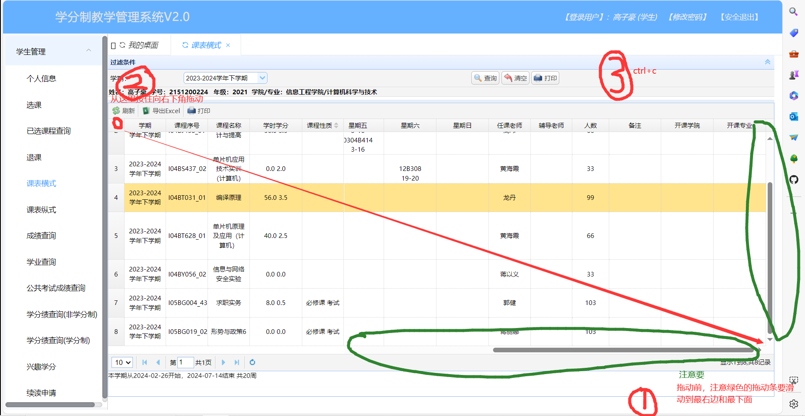
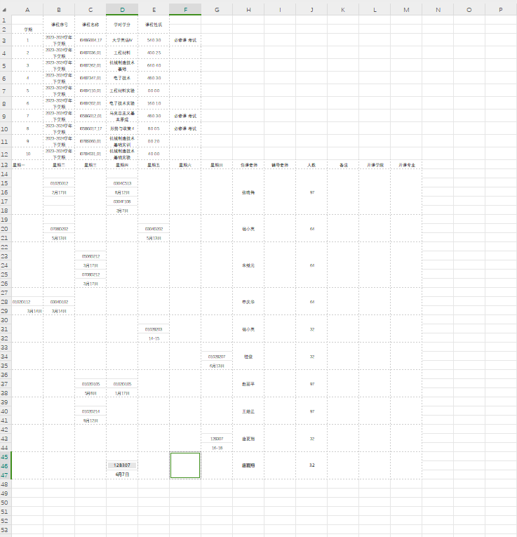

# merge

汇总桂林信息科技学院课表信息。

**使用步骤**
- 收集学生课表信息，并检查检查格式请依照《课表信息规范》
- 放到./now_excel/xlsx文件夹下
- 运行main.py
- 汇总结果在./now_excel/总表.xlsx中

**课表信息收集步骤**

- 从教务系统拷贝课表
     ||
- 新建一个excel文件，以学生自己名字命名。
- 在新建的excel文件中，粘贴
- 粘贴后如图所示
||

**课表信息规范**

- 课表信息解析：0102D201
-  ---0102-----D-------201
- 上课时间-教学楼-教室
- 所有的课表信息必须是按照0102D201这个格式来写
- 实验课和实训课等课程需要修改为12+字母+任意数字的格式，例如12B23
- 上课的周数规范为：1-7，开始周数-结束周数，(可以出现某月某日的格式，不允许有7~9，不允许一格内出现多个，例如7-8，9-10)